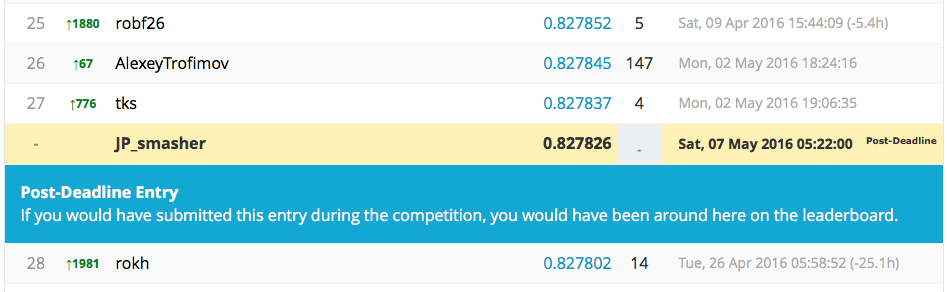

# Santander Customer Satisfaction Challenge

My attempts for the above specified challenge. To run the code, do create the following sub-directories
santander
 - data
   - train.csv
   - test.csv
 - plots
 - models
 - ref
   - Spanish2English.csv (for translating spanish column names to English)

In addition, you might want to ensure that you have the relevant dependencies/packages installed.

You can then run the main script which does the cross-validation for parameter searching with the following:

```
Rscript xgb_cv.R
```

To blend the final submissions together, run the following on the command line:

```
Rscript ensembler.R
```

Too bad I was a little lazy and didn't ensemble my models for the final submission. It would have gotten me 27th place on the private LB:


